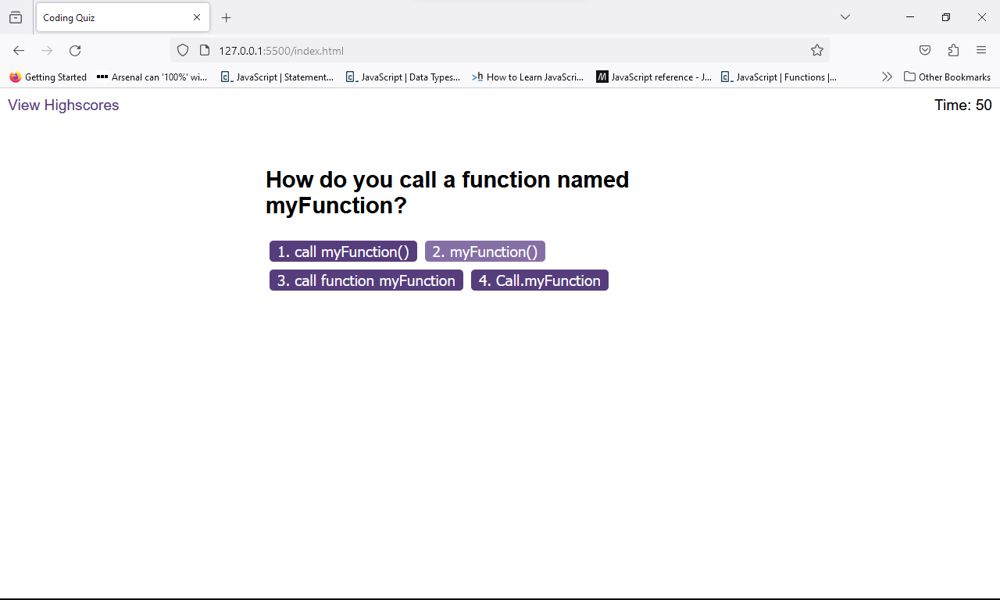

# JavaScript-Quiz

This project is designed to create a JavaScript Quiz that works with a timer. 
Once the quiz is started a timer works in tandem with a multiple choice button quiz. 
If the player gets an answer wrong the time decreases.
If the player gets an answer correct then the time decreases at the normal speed.
After all the questions are answered the player will be able to log their score along with initials onto the highscores leaderboard. 

# Contributors
Dale Warburton

# Licences 
None

Below is a working image of the site in action and a link to the application can be found here https://dezmondo7.github.io/JavaScript-Quiz/

